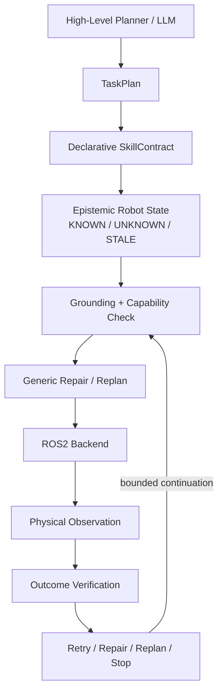

# EmbodiedSkill-ROS

**Contract-Driven Reliable Skill Execution for ROS2 Robots**

EmbodiedSkill-ROS addresses a practical robotics gap: a ROS action or SDK call can
return success while the intended physical state transition never occurs. It is a
planner-independent execution layer that grounds high-level plans in robot state,
checks backend semantics, executes through ROS2, observes the resulting state, and
selects bounded retry, repair, replanning, or stop behavior from explicit contracts.

```text
Planner / LLM  →  EmbodiedSkill-ROS  →  ROS2 / Robot Backend
                    GROUND
                      ↓
                   EXECUTE
                      ↓
                   OBSERVE
                      ↓
                   VERIFY
                      ↓
             RETRY / REPAIR / REPLAN / STOP
```

## Project at a glance

| | |
|---|---|
| Domain | ROS2, embodied robotics, reliable execution |
| Language | Python |
| Validated platform | Ubuntu 22.04.5, ROS2 Humble, Fast DDS |
| Architecture | Contract-driven execution layer between planner and backend |
| Evaluation | Fault injection, independent oracle, ablation, frozen holdout |
| Runtime | Process-separated ROS2 fake robot using topics, services, and actions |
| Hardware | JAKA mapping statically inspected; hardware unverified |

## Key evidence

| Result | What it means |
|---:|---|
| **15 / 15** | required process-separated ROS2 runtime scenarios produced the expected decision |
| **107** | tests passed under the ROS2 Humble / colcon validation environment |
| **25 / 25** | feasible cases completed in the frozen adversarial V2 design suite |
| **60 / 65 (92.31%)** | correct decisions across all adversarial V2 trials |
| **12 files / 1,385 LOC** | frozen reasoning core protected by a hash manifest |
| **0 core modifications** | two new preparation skills generalized through declarative effects after core freeze |

These are deterministic artifact results, not deployment statistics. Seven of the
15 ROS2 scenarios complete their task; eight correctly stop and are not counted as
task successes.

| Validation boundary | Status |
|---|---|
| Pure-Python core and Mock experiments | `UNIT-VERIFIED` / `MOCK-VERIFIED` |
| Fixed, procedural, adversarial, ablation, and frozen holdout evaluation | `BENCHMARK-VERIFIED` |
| Process-separated fake-robot runtime on Ubuntu 22.04.5 / ROS2 Humble | `ROS2-RUNTIME-VERIFIED` |
| JAKA API and capability mapping | `STATICALLY-INSPECTED` |
| JAKA robot hardware | `UNVERIFIED` |
| Gazebo / MoveIt2 physics simulation | `UNVERIFIED` |

Demo video: pending a real recording. No screenshot, simulator run, or hardware video
is claimed by this release.

## 30-second architecture



Planning and execution reliability are deliberately separated. A deterministic
planner, an LLM adapter, or another planning system can produce `TaskPlan`; the
execution layer remains responsible for state grounding and evidence-based outcome
verification.

## Middleware success ≠ physical success

The clearest negative control is ROS2 runtime scenario R3:

```text
ROS Action Goal
      ↓
   ACCEPTED
      ↓
Action Result: SUCCEEDED
      ↓
Fake Robot Hidden State: NO TARGET TRANSITION
      ↓
Fresh ROS Topic Observation
      ↓
OutcomeVerifier: FAILURE
      ↓
     STOP
```

EmbodiedSkill-ROS does not treat ROS Action `SUCCEEDED` as evidence that the
contracted physical effect occurred. The action result and post-command observation
remain separate trace records. See the
[runtime report](docs/ROS2_RUNTIME_VALIDATION_REPORT.md) and
[machine-readable trace](ros2_validation_outputs/runtime_scenarios.json).

## Starting point & my contributions

### Existing laboratory / reference system

The starting point provided:

- JAKA / ROS2 robot skill wrappers and SDK/service interfaces;
- elementary arm, AGV, lift, and head skills; and
- a function-calling dispatcher/reference agent.

That separately delivered reference workspace is not redistributed in this
repository. EmbodiedSkill-ROS does not claim that the JAKA robot system or its
elementary hardware skills were built from scratch here.

### My work in EmbodiedSkill-ROS

Based on those existing skill/backend interfaces, I designed and implemented a
separate reliable embodied skill execution layer:

- declarative `SkillContract` schemas, predicates, resources, effects, timeouts,
  and recovery policies;
- epistemic `KNOWN`, `UNKNOWN`, `STALE`, and contradictory robot state;
- generic effect-driven preparation repair and structural goal-directed replanning;
- backend capability and unavoidable-side-effect preflight;
- separation of command receipt, observation, verification, and hidden truth;
- an independent hidden-state benchmark oracle and deterministic fault injection;
- fixed, procedural, adversarial V2, A–F ablation, and frozen holdout evaluation;
- a process-separated ROS2 Humble runtime using topics, services, and actions; and
- a static JAKA capability/semantic-scope audit with explicit failure boundaries.

## Core design

### Declarative contracts and epistemic state

Each skill declares what it requires and what it is expected to change. The executor
does not silently interpret unavailable safety state as safe: evidence can be known,
unknown, stale, or contradictory, and contracts can require bounded active refresh.

### Bounded generic repair, not a general planner

Repair uses declarative effect search rather than branching on concrete skill names.
The frozen-core extension experiment begins with only `transport_payload` planned:

```text
deploy_stabilizer
→ secure_payload
→ transport_payload
```

The two preparation skills were added after the reasoning core was frozen. The same
bounded search inserted them with **zero changes to the 12 frozen core files**. This
is evidence for contract-driven extensibility, not a claim of general task-and-motion
planning or optimal search.

### Structural replanning

Replanning must change the failed suffix. ROS2 scenario R11 makes `primary_route`
permanently ineffective; the replanner selects `alternate_route`, while a retry-only
counterfactual sends the primary action three times and still fails.

### Backend capability contracts

The JAKA audit exposes a concrete semantic mismatch:

```text
Abstract contract: retract LEFT arm only
Legacy JAKA preset: potentially moves BOTH arms
```

Because abstract scope is narrower than the unavoidable backend effect, capability
preflight rejects the command before transmission. The JAKA mapping is only
`STATICALLY-INSPECTED`; this is not JAKA runtime or hardware evidence.

## ROS2 runtime validation

The validated runtime path is:

```text
EmbodiedSkill Core
        ↓
ROS2 Action
        ↓
Independent Fake Robot Process
        ↓
Hidden Physical State
        ↓
ROS2 Topic Observation
        ↓
Outcome Verifier
```

The fake robot is a separate OS process, not a direct Python backend call and not a
physics simulator. Long-running and cancellable commands use a ROS action; state is
published asynchronously; short reset, refresh, capability, and stop operations use
services. The validation action uses a standard action as a test-only lifecycle
envelope rather than claiming a production robot command schema.

R1–R15 cover nominal execution, command rejection, accepted/no-motion, delayed
observation, stale and unknown safety evidence, successful and failed refresh,
transient recovery, generic repair, structural replanning, capability mismatch,
timeout, cancellation, and terminal stop behavior.

## Evaluation summary

### Frozen adversarial V2 and holdout

| Evaluation | Correct decisions | Feasible completion | Correct safe handling | Unsafe / false positive |
|---|---:|---:|---:|---:|
| Designed V2 (65) | 60/65 (92.31%) | 25/25 | 35/40 | 5/65 |
| Frozen holdout (78) | 72/78 | 30/30 | 42/48 | 6/78 |

The five design-suite false positives are the intentionally preserved
`fresh_sensor_spoof` family. Metric definitions, family results, coupling controls,
and A–F/removal ablations are in the
[V2 methodology](docs/BENCHMARK_V2_METHODOLOGY.md).

### Corrected fixed benchmark

The smaller 30-scenario deterministic Mock benchmark remains useful as an engineering
regression, not as the headline evidence:

| Configuration | Task success | Invalid skill calls |
|---|---:|---:|
| Direct function calling | 60.00% | 14.55% |
| State-grounded | 83.33% | 0.00% |
| State-grounded + recovery | 93.33% | 0.00% |

Historical methodology corrections are documented outside this portfolio summary.

## Known failure boundaries

- **Fresh evidence is not truthful evidence.** A fresh false sensor observation can
  fool outcome verification; the independent oracle records the false positive.
- **Freshness is not an atomic safety guarantee.** The ROS2 TOCTOU probe observes a
  safe state, then changes the world before dispatch; unsafe motion still occurs.
- **STOP is a policy decision, not a universal physical-stop proof.** Recovery
  exhaustion paths call the backend stop operation, but some early grounding/preflight
  STOP exits in the frozen executor do not transmit that operation. R15 blocks the
  prohibited command while emergency stop is already observed active.
- The synchronous executor has no caller-facing cancellation API, although the ROS2
  backend can cancel actions and R14 verifies coherent adapter state afterward.
- No collision safety, real-time guarantee, safety-rated interlock, sensor-fault
  tolerance, simulation validity, or hardware safety is claimed.

The complete failure ledger is in
[docs/REMAINING_FAILURE_MODES.md](docs/REMAINING_FAILURE_MODES.md).

## JAKA status

`JakaRobotBackend` wraps already initialized legacy objects without importing vendor
packages at core import time. Static inspection found open-loop AGV displacement,
bilateral arm-preset scope, sequential head side effects, synchronous lift semantics,
and an AGV-only stop that cannot be advertised as whole-robot safe stop.

See the [JAKA capability audit](docs/JAKA_CAPABILITY_AUDIT.md). Hardware execution,
transport-pose calibration, odometry, whole-robot stopping, and supervised validation
remain `UNVERIFIED`.

## Quick reproduction

The pure-Python core requires Python 3.9+ and has no mandatory third-party runtime
dependency:

```bash
PYTHONPATH=. python3 -m unittest discover -s tests -v
```

Without ROS2, ROS-marked tests skip explicitly. On Ubuntu 22.04 with ROS2 Humble:

```bash
source /opt/ros/humble/setup.bash

colcon build --symlink-install --packages-select embodied_skill_ros
source install/setup.bash

ROS_LOG_DIR=/tmp/embodied_skill_ros_logs ROS_LOCALHOST_ONLY=1 \
  colcon test --packages-select embodied_skill_ros

colcon test-result --all --verbose
```

Expected validated result: **107 tests, zero errors, zero failures, zero skips**.

Run the process-separated scenario harness:

```bash
ROS_LOG_DIR=/tmp/embodied_skill_ros_logs ROS_LOCALHOST_ONLY=1 \
  ros2 run embodied_skill_ros validate_runtime \
  --output ros2_validation_outputs/runtime_scenarios.json
```

Expected summary: **15/15 required scenarios pass** and both unsafe limitation
probes—fresh sensor spoof and TOCTOU—remain reproduced.

## Documentation map

- [Validation evidence ledger](docs/VALIDATION_EVIDENCE.md)
- [ROS2 runtime report](docs/ROS2_RUNTIME_VALIDATION_REPORT.md)
- [Machine-readable ROS2 traces](ros2_validation_outputs/README.md)
- [Adversarial V2 methodology](docs/BENCHMARK_V2_METHODOLOGY.md)
- [Frozen-core reproducibility](docs/STANDALONE_REPRODUCIBILITY.md)
- [JAKA capability audit](docs/JAKA_CAPABILITY_AUDIT.md)
- [Architecture details](docs/NEW_ARCHITECTURE.md)
- [Literature and novelty boundaries](docs/LITERATURE_AND_NOVELTY.md)
- [Remaining failure modes](docs/REMAINING_FAILURE_MODES.md)
- [Current project report](FINAL_REPORT.md)

## Roadmap

Portfolio v0.2.0 freezes the current evidence-backed execution artifact. Near-term
work is deliberately narrow: record a real demo, add externally administered tasks,
and validate a physics simulator or supervised robot backend without changing the
meaning of existing benchmark results. An optional research track may study
version/evidence-guarded command admission for ROS2 check→dispatch races; it is not
required for the current project claims.

See [ROADMAP.md](ROADMAP.md) for the status-separated roadmap.
