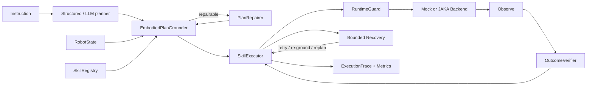

# EmbodiedSkill-ROS

**State-Grounded Planning and Risk-Aware Execution for ROS2 Mobile Manipulators**

EmbodiedSkill-ROS turns an LLM's high-level tool plan into a state-grounded, closed-loop robot execution process that prefers **EXECUTE → REPAIR → REPLAN → STOP**.

> **Demo media placeholder:** replace `docs/assets/embodied_skill_ros_demo.gif` with a recorded Mock/hardware demo. No video is claimed in this repository yet.

## Validation status

| Capability | Evidence |
|---|---|
| Core models, grounding, repair, verification, recovery, tests, demos | `MOCK-VERIFIED` |
| 96.67% task success | `MOCK-VERIFIED` on 30 predefined deterministic scenarios only |
| Original ROS2/JAKA interface mapping | `STATICALLY-INSPECTED` from a separately delivered reference workspace |
| ROS2 Humble / Ubuntu 22.04 build | `UNVERIFIED` (`colcon` and ROS2 were unavailable) |
| JAKA hardware execution and transport-safe pose calibration | `UNVERIFIED` |
| Gazebo, MoveIt2, and RViz integration | `PLANNED` |

`CommandReceipt.accepted` is never presented as evidence that a real physical outcome occurred. In Mock execution, outcome success is determined from observed state; hardware validation still requires measured state providers and calibrated tolerances.

## Core question

How can an LLM plan be grounded in the robot's current body state, available skills, actuator constraints, and measured outcomes? When a state mismatch or execution failure occurs, can the system repair or replan instead of immediately rejecting the task—or blindly continuing?

The project focuses on embodied task planning and execution reliability: approximately 70% state grounding, multi-component coordination, and physical outcome verification; 30% runtime constraints and recovery.

## Architecture



See [docs/NEW_ARCHITECTURE.md](docs/NEW_ARCHITECTURE.md) for the full architecture and sequence diagrams.

## Main contributions

1. Unified embodied skill representation for heterogeneous robot components.
2. State-grounded task planning and deterministic automatic plan repair.
3. Closed-loop execution that distinguishes command acceptance from physical outcome achievement.
4. Risk-aware, bounded runtime recovery for multi-component mobile manipulators.
5. Reproducible Mock fault injection and a 30-scenario A/B/C/D benchmark.

## Why this is different from direct function calling

| Direct function calling | EmbodiedSkill-ROS |
|---|---|
| Tool name + arguments | Skill schema + resources + preconditions + expected effects + timeout + recovery |
| Conversation history as context | Typed, timestamped `RobotState`; UNKNOWN is explicit |
| Execute calls in model-provided order | Validate, project state, repair ordering, then execute |
| Function return often becomes “success” | `CommandReceipt` and physical `VerificationResult` are separate |
| Failure text goes back to the model | Bounded retry, re-ground, replan, then safe stop |
| No reproducible failure model | Deterministic fault injection and independent final-state scoring |

## Quick start

Requirements: Python 3.10+; the Mock core has no third-party runtime dependency.

```bash
cd embodied_skill_ros
python3 examples/normal_task.py
python3 examples/state_grounded_task.py
python3 examples/plan_repair_demo.py
python3 examples/recovery_demo.py
```

Run the standard-library test suite:

```bash
PYTHONPATH=. python3 -m unittest discover -s tests -v
```

The tests are also pytest-compatible when pytest is installed:

```bash
python3 -m pytest
```

## Mock demos

### Normal multi-step task

`normal_task.py` executes “收回右臂，移动到工作台旁，然后升高升降轴” and verifies every step.

### Same instruction, different body state

`state_grounded_task.py` runs “移动到工作台” twice:

- `right_arm_safe=true` → `move_agv`
- `right_arm_safe=false` → inserted `retract_arm` → `move_agv`

### Body-resource conflict

`plan_repair_demo.py` starts with arm extension and fast AGV motion in one parallel group. The grounder serializes the request and inserts a transport-safe arm action before base motion.

### Accepted command, failed outcome

`recovery_demo.py` injects a lift command whose receipt is accepted while height feedback remains unchanged. The verifier detects the mismatch and a bounded local retry succeeds.

## JAKA hardware adapter — `STATICALLY-INSPECTED`, hardware `UNVERIFIED`

`JakaRobotBackend` wraps the already-initialized legacy objects from `real_sdk_skills.make_real_sdk_skills(...)`; the new core does not import ROS2 or embed network configuration.

```python
from embodied_skill_ros.backends import JakaRobotBackend

backend = JakaRobotBackend(
    arm_skill=legacy_arm,
    agv_skill=legacy_agv,
    lift_skill=legacy_lift,
    head_skill=legacy_head,
    transport_pose_name="<locally validated preset>",
    state_provider=my_verified_robot_state_provider,
    agv_position_provider=my_verified_odometry_provider,
)
```

Important: merely configuring a preset name does not prove that an arm is transport-safe. Without a measured, deployment-validated state provider, arm safety, AGV motion state, faults, and emergency stop remain `UNKNOWN`; the system will not fabricate them. The current `safe_stop` adapter only sends the confirmed legacy AGV stop call.

## Benchmark — `MOCK-VERIFIED`

`benchmarks/scenarios.json` contains 30 deterministic scenarios:

- 5 single-step;
- 10 multi-step/multi-component;
- 5 initial-state variations;
- 5 body-resource conflicts;
- 5 timeouts, command failures, physical failures, or state drift cases.

Run and evaluate:

```bash
python3 benchmarks/run_benchmark.py
python3 benchmarks/evaluate.py
```

The runner compares:

- A: Direct Function Calling baseline;
- B: Structured Sequential Plan;
- C: State-Grounded Plan;
- D: State-Grounded Plan + Runtime Recovery.

Success is computed from final Mock physical state, independently of `ExecutionReport.success`.

## Reproduced results

The following values come from the checked-in `benchmarks/benchmark_results.json`. The **96.67% result is limited to 30 predefined deterministic Mock scenarios**; it is not a ROS2 simulation or hardware success rate. Latency is local Python runtime and should not be compared with hardware latency.

| Configuration | Task success | Long-horizon | State-change | Invalid calls | Repair success | Recovery rate | Verification accuracy | Avg. steps |
|---|---:|---:|---:|---:|---:|---:|---:|---:|
| A Direct | 60.00% | 100.00% | 0.00% | 14.55% | 0.00% | 0.00% | 81.82% | 1.83 |
| B Structured | 60.00% | 100.00% | 0.00% | 12.96% | 0.00% | 0.00% | 100.00% | 1.80 |
| C Grounded | 83.33% | 100.00% | 100.00% | 0.00% | 100.00% | 0.00% | 100.00% | 2.10 |
| D Grounded + Recovery | **96.67%** | **100.00%** | **100.00%** | **0.00%** | **100.00%** | **80.00%** | **100.00%** | 2.33 |

These are deterministic Mock results, not hardware claims. The one D failure is the intentionally persistent “AGV unavailable” scenario, which safely stops after recovery options are exhausted.

## Documentation map

- Original system: [analysis](docs/ORIGINAL_SYSTEM_ANALYSIS.md), [call chain](docs/CALL_CHAIN.md), [skills](docs/SKILL_INVENTORY.md), [ROS2 interfaces](docs/ROS2_INTERFACE_INVENTORY.md), [migration risks](docs/MIGRATION_RISKS.md)
- New system: [architecture](docs/NEW_ARCHITECTURE.md), [data model](docs/DATA_MODEL.md), [constraints](docs/EMBODIED_CONSTRAINTS.md), [implementation status](docs/IMPLEMENTATION_PLAN.md)
- Project summary: [FINAL_REPORT.md](FINAL_REPORT.md)

## Known limitations

- Hardware execution was not available in this environment; Mock behavior is tested, JAKA wiring is not physically validated.
- Transport-safe arm classification needs calibrated joint/TCP envelopes.
- The legacy elementary AGV path is open-loop; odometry must be supplied for physical displacement verification.
- The deterministic language planner intentionally covers only the demos. The provider-neutral LLM adapter validates structured JSON but does not bundle a model client or credentials.
- Parallel requests are conservatively serialized; no concurrent scheduler is implemented.
- Parameter correction and alternative-skill selection are future recovery stages; bounded retry, preparation insertion, re-grounding, replanning, and stopping are implemented.
- Elapsed timeout is detected after a synchronous backend call returns. Deployment ROS2 clients should add future cancellation/timeouts.

## Roadmap

See [ROADMAP.md](ROADMAP.md). Every roadmap item is `PLANNED`, including ROS2 Humble validation, an independent hold-out benchmark, simulation integration, and supervised JAKA hardware validation.
