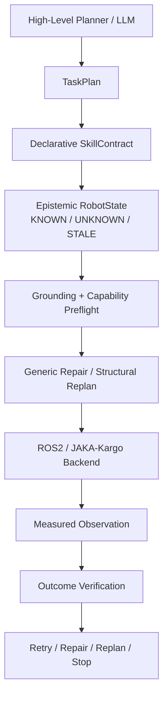

[English](README.md) | **简体中文**

# EmbodiedSkill-ROS

**面向 ROS2 机器人的契约驱动可靠技能执行层**

EmbodiedSkill-ROS 处理一个具体的机器人执行问题：ROS Action、Service 或 SDK
返回成功，不代表目标物理状态真的发生了变化。本项目把高层 Planner / LLM 与
机器人后端分离，并负责：状态落地、能力预检、命令执行、重新观测、效果验证，
以及有界的重试、修复、重规划或停止。

```text
Planner / LLM → EmbodiedSkill-ROS → ROS2 / Robot Backend
                    GROUND
                      ↓
                   EXECUTE
                      ↓
                   OBSERVE
                      ↓
                   VERIFY
                      ↓
             RETRY / REPAIR / REPLAN / STOP
```

## 项目概览

| 项目 | 当前证据 |
|---|---|
| 平台 | Ubuntu 22.04.5、ROS2 Humble、Fast DDS、Python 3.10 |
| v0.2 ROS2 核心 | R1–R15 全部得到预期决策；107/107 tests |
| JAKA/Kargo skills | 5 个已映射技能 |
| JAKA/Kargo ROS interfaces | 8 个已验证 endpoint；9/9 独立进程场景 |
| 扩展测试环境 | 128/128 tests（107 个 v0.2 + 20 个 integration contract + 1 个 integration runtime） |
| 对抗 V2 | 60/65 正确决策；25/25 可完成任务完成；5 个 fresh-sensor-spoof 假阳性 |
| 冻结推理核心 | 12 files / 1,385 LOC；本次修改 0 个 |
| 真机 | JAKA/Kargo 外部包可构建；vendor node runtime 和 hardware 均未验证 |

这些数字来自确定性 artifact validation，不是部署成功率。扩展环境的 128 项
测试需要单独交付的 `jagv_interfaces` 与 `jaka_toolbox_interfaces` 已构建并 source；
缺少它们时，integration runtime test 会明确跳过。

## 30 秒架构



Planner 只负责产生计划；执行可靠性由 EmbodiedSkill-ROS 管理。

## Middleware success ≠ physical success

v0.2 的 R3 和 v0.3 integration 的 J2 都验证了同一条原则：

```text
ROS 命令返回 SUCCESS
        ↓
独立进程中的隐藏物理状态没有变化
        ↓
新的 ROS observation 到达
        ↓
OutcomeVerifier 判定 FAILURE
        ↓
STOP
```

J2 使用真实 legacy 生成的 Service 类型：`/joint_move_ext` 返回成功，但 stub
没有移动 lift，后续 `/query_status_ext` 仍是旧位置。因此系统不会把 command
receipt 当成物理效果证明。

## Starting point 与个人贡献边界

### 实验室 / 学长已有系统

起点已经包含：

- JAKA / ROS2 wrapper、elementary robot skills；
- SDK / Service interfaces、robot description、vendor SDK；
- arm、AGV、lift、head、waist 控制；
- function-calling dispatcher / reference agent。

原始 workspace 不在本仓库中重新发布。本项目不声称从零实现整套 JAKA 系统。

### Core redesign — 我的工作

- 声明式 `SkillContract`、谓词、效果、资源、timeout 和 recovery policy；
- `KNOWN / UNKNOWN / STALE / CONTRADICTORY` epistemic state；
- generic effect-driven repair 与 structural goal-directed replanning；
- backend capability / unavoidable-side-effect preflight；
- command receipt、observation、verification 与 hidden truth 分离；
- independent oracle、fault injection、adversarial V2、ablation 与 frozen holdout；
- process-separated ROS2 Humble fake-robot runtime。

### System integration — 我的工作

- `JakaKargoBackend`：统一异构 legacy Service 语义；
- `JakaKargoStateProvider`：只依据 measured feedback 构造 RobotState；
- `JakaKargoCapabilityMapper`：表达 endpoint、side effect、timeout、cancellation、
  observation 与 stop scope；
- lazy ROS2 transport、只读 probe、external dependency boundary；
- 20 个 integration contract tests 与 9 个 exact-schema ROS2 runtime scenarios；
- deployment、provenance、IP 与 failure-boundary audit。

准确表述是：基于实验室提供的 JAKA/Kargo ROS2 skill stack，我设计可靠执行层，
并实现将其 contract、state、verification 和 recovery 语义重新接入原系统的边界。

## JAKA/Kargo integration

```text
EmbodiedSkill-ROS Core
        ↓
JakaKargoBackend
        ↓
State Provider + Capability Mapper
        ↓
JakaKargoRos2Transport
        ↓
外部 jaka_toolbox_interfaces / jagv_interfaces
        ↓
现有 jaka_toolbox / JAGV nodes
        ↓
Vendor SDK / Robot
```

当前映射五个技能：单臂收回、AGV map-X 移动、lift、head 和 waist。runtime
harness 覆盖六个 Service 与两个异步 AGV topic。State provider 读取双臂 joints、
四个外部轴、odometry 和 AGV motion/fault state；没有测量或没有校准的字段保持
`UNKNOWN`；`PoseQuery` success 默认也不等于 arm readiness，不会根据 Service
success 虚构状态。
AGV 命令之后必须同时等到新的 odometry 与 motion-state revision，不能立即复用
命令前的 topic cache。

能力预检会拒绝语义不匹配。例如 legacy bilateral preset 可能同时移动两臂，
不能静默满足 “只收回左臂” 的抽象 contract。AGV stop 被诚实标为 `AGV_ONLY`；
Service client timeout 也不被描述成物理 cancellation。

证据分级：

| 项目 | 状态 |
|---|---|
| legacy source/interface semantics | `STATICALLY-INSPECTED` |
| 外部 interface packages 与未修改的 `jaka_toolbox` | `ROS2-BUILD-VERIFIED` |
| adapter contract mapping | `UNIT-VERIFIED` |
| 独立进程、exact-schema integration stub | `ROS2-RUNTIME-VERIFIED` |
| 外部 vendor-backed JAKA node runtime | `UNVERIFIED` |
| JAKA hardware | `UNVERIFIED` |
| Gazebo / MoveIt2 physics simulation | `UNVERIFIED` |

## Evaluation 与已知边界

| Evaluation | 正确决策 | 可完成任务 | 正确安全处理 | 不安全 / 假阳性 |
|---|---:|---:|---:|---:|
| Designed V2 (65) | 60/65 (92.31%) | 25/25 | 35/40 | 5/65 |
| Frozen holdout (78) | 72/78 | 30/30 | 42/48 | 6/78 |

- `fresh_sensor_spoof`：fresh evidence 不等于 truthful evidence；该失败被有意保留。
- ROS2 TOCTOU：freshness 不能让 observe→dispatch 变成原子安全操作。
- STOP 是 policy decision，不是 whole-robot physical stop 的通用证明。
- 同步 executor 没有 caller-facing cancellation API；legacy Service timeout 也不能
  保证服务端动作停止。
- 不声称 collision safety、real-time guarantee、safety-rated interlock、sensor
  fault tolerance、physics simulation validity 或 hardware safety。

## 快速复现

纯 Python：

```bash
PYTHONPATH=. python3 -m unittest discover -s tests -v
```

ROS2 Humble baseline：

```bash
source /opt/ros/humble/setup.bash
colcon build --symlink-install --packages-select embodied_skill_ros
source install/setup.bash
ROS_LOG_DIR=/tmp/embodied_skill_ros_logs ROS_LOCALHOST_ONLY=1 \
  colcon test --packages-select embodied_skill_ros
colcon test-result --all --verbose
ROS_LOG_DIR=/tmp/embodied_skill_ros_logs ROS_LOCALHOST_ONLY=1 \
  ros2 run embodied_skill_ros validate_runtime \
  --output ros2_validation_outputs/runtime_scenarios.json
```

预期：v0.2 baseline 107/107，R1–R15 全部符合预期；fresh spoof 与 TOCTOU
限制仍可复现。

JAKA/Kargo integration 需要在仓库外构建并 source 两个 interface packages：

```bash
source /opt/ros/humble/setup.bash
source /path/to/kargo_ws_delivery_20260521/install/setup.bash
source install/setup.bash
ROS_LOG_DIR=/tmp/embodied_skill_jaka_logs ROS_LOCALHOST_ONLY=1 \
  ros2 run embodied_skill_ros validate_jaka_kargo \
  --output jaka_kargo_validation_outputs/integration_scenarios.json
```

预期：9/9 integration scenarios。该 harness 启动 legacy-compatible stub，
不加载 vendor SDK，也不运动真机。

## 文档入口

- [验证证据账本](docs/VALIDATION_EVIDENCE.md)
- [ROS2 runtime 报告](docs/ROS2_RUNTIME_VALIDATION_REPORT.md)
- [JAKA/Kargo integration 分析](docs/JAKA_KARGO_INTEGRATION_ANALYSIS.md)
- [JAKA/Kargo interface matrix](docs/JAKA_KARGO_INTERFACE_MATRIX.md)
- [已知 failure modes](docs/REMAINING_FAILURE_MODES.md)
- [完整英文主页](README.md)

v0.2.0 是已冻结的 ROS2 core milestone。v0.3.0 在不修改冻结推理核心的前提下
正式发布 JAKA/Kargo integration layer。Vendor-backed node runtime、受审查的部署
配置与受监督真机验证仍是后续 deployment gate；v0.3.0 不是 hardware release。
