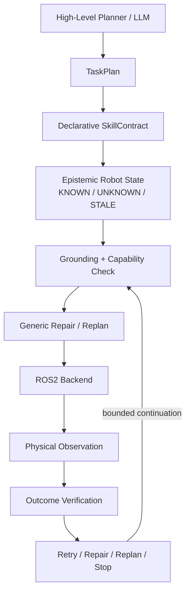

[English](README.md) | **简体中文**

# EmbodiedSkill-ROS

**面向 ROS2 机器人的契约驱动可靠技能执行框架**

EmbodiedSkill-ROS 关注机器人系统中的一个实际问题：ROS Action 或 SDK 调用即使返回成功，也不代表预期的物理状态转移真的发生。它是一个与具体 Planner 解耦的执行层：将高层计划与机器人当前状态进行 grounding，检查 backend 的实际语义，通过 ROS2 执行技能，观测执行后的状态，并根据显式契约在有限范围内选择重试、修复、重规划或停止。

```text
Planner / LLM  →  EmbodiedSkill-ROS  →  ROS2 / Robot Backend
                    GROUND
                      ↓
                   EXECUTE
                      ↓
                   OBSERVE
                      ↓
                   VERIFY
                      ↓
             RETRY / REPAIR / REPLAN / STOP
```

## 项目概览

| | |
|---|---|
| 领域 | ROS2、具身机器人、可靠执行 |
| 语言 | Python |
| 已验证平台 | Ubuntu 22.04.5、ROS2 Humble、Fast DDS |
| 架构 | 位于 Planner 与 Robot Backend 之间的契约驱动执行层 |
| 评测 | 故障注入、独立 oracle、消融实验、冻结后 holdout |
| Runtime | 使用 Topic、Service 与 Action 的进程隔离 ROS2 fake robot |
| 硬件 | JAKA 映射完成静态审计；真机未验证 |

## 关键证据

| 结果 | 含义 |
|---:|---|
| **15 / 15** | 所有要求的进程隔离 ROS2 runtime 场景都产生了预期决策 |
| **107** | 在 ROS2 Humble / colcon 验证环境下通过的测试数 |
| **25 / 25** | 冻结后的 adversarial V2 设计集中，所有物理上可行的 case 均完成任务 |
| **60 / 65 (92.31%)** | adversarial V2 全部试验中的正确决策数 |
| **12 files / 1,385 LOC** | 由 hash manifest 保护的冻结 reasoning core |
| **0 core modifications** | core freeze 后新增两项 preparation skill 时，冻结 core 无需修改 |

这些数字是确定性 artifact 结果，不是部署环境中的统计性能。15 个 ROS2 场景中有 7 个完成预期任务，另外 8 个正确停止；后者不会被计为“任务成功”。

| 验证边界 | 状态 |
|---|---|
| Pure-Python core 与 Mock 实验 | `UNIT-VERIFIED` / `MOCK-VERIFIED` |
| Fixed、procedural、adversarial、ablation 与 frozen holdout 评测 | `BENCHMARK-VERIFIED` |
| Ubuntu 22.04.5 / ROS2 Humble 上的进程隔离 fake-robot runtime | `ROS2-RUNTIME-VERIFIED` |
| JAKA API 与 capability mapping | `STATICALLY-INSPECTED` |
| JAKA 真机 | `UNVERIFIED` |
| Gazebo / MoveIt2 物理仿真 | `UNVERIFIED` |

演示视频：等待真实录制。本 release 不声称已经有截图、仿真运行视频或真机视频。

## 30 秒架构



本项目刻意将规划与执行可靠性分离。确定性 Planner、LLM adapter 或其他规划系统都可以生成 `TaskPlan`；EmbodiedSkill-ROS 的执行层负责状态 grounding 与基于证据的 outcome verification。

## Middleware success ≠ physical success

最直观的 negative control 是 ROS2 runtime 场景 R3：

```text
ROS Action Goal
      ↓
   ACCEPTED
      ↓
Action Result: SUCCEEDED
      ↓
Fake Robot Hidden State: NO TARGET TRANSITION
      ↓
Fresh ROS Topic Observation
      ↓
OutcomeVerifier: FAILURE
      ↓
     STOP
```

EmbodiedSkill-ROS 不会把 ROS Action 的 `SUCCEEDED` 直接当作契约所要求的物理效果已经实现。Action result 与执行后的 observation 会作为相互独立的 trace 记录。详见 [ROS2 runtime report](docs/ROS2_RUNTIME_VALIDATION_REPORT.md) 和 [machine-readable trace](ros2_validation_outputs/runtime_scenarios.json)。

## 项目起点与我的贡献

### 已有实验室 / reference system

项目起点已经提供：

- JAKA / ROS2 robot skill wrappers 以及 SDK / service interfaces；
- 基础的机械臂、AGV、升降轴和头部技能；
- function-calling dispatcher / reference agent。

这套单独交付的 reference workspace 不会在本仓库中重新分发。EmbodiedSkill-ROS 不声称从零构建了整套 JAKA 机器人系统，也不声称这里的基础硬件技能全部由本项目重新实现。

### 我在 EmbodiedSkill-ROS 中完成的工作

基于已有的 skill / backend interface，我设计并实现了一个独立的可靠具身技能执行层，包括：

- 声明式 `SkillContract`：schema、predicate、resource、effect、timeout 与 recovery policy；
- `KNOWN`、`UNKNOWN`、`STALE` 以及 contradictory 的 epistemic robot state；
- generic effect-driven preparation repair 与 structural goal-directed replanning；
- backend capability 与 unavoidable-side-effect preflight；
- command receipt、observation、verification 与 hidden truth 的分离；
- 独立 hidden-state benchmark oracle 与确定性 fault injection；
- fixed、procedural、adversarial V2、A–F ablation 与 frozen holdout 评测；
- 基于 Topic、Service 和 Action 的进程隔离 ROS2 Humble runtime；
- JAKA capability / semantic scope 的静态审计，并明确保留 failure boundaries。

## 核心设计

### 声明式契约与 epistemic state

每个 skill 都显式声明执行所需条件以及期望改变的状态。Executor 不会把缺失的安全信息默认为“安全”：证据可以是 known、unknown、stale 或 contradictory，contract 也可以要求进行有限次数的主动 refresh。

### 有界 generic repair，而不是通用 Planner

Repair 基于声明式 effect search，而不是对具体 skill name 写硬编码分支。冻结 core 之后的扩展实验中，初始计划只有 `transport_payload`：

```text
deploy_stabilizer
→ secure_payload
→ transport_payload
```

这两个 preparation skill 是在 reasoning core 冻结之后才新增的。相同的 bounded search 能自动插入它们，同时 **12 个冻结 core 文件保持零修改**。这个结果支持“contract-driven extensibility”，但并不代表系统是通用 task-and-motion planner，也不代表搜索是最优的。

### Structural replanning

Replanning 必须真正改变失败的计划后缀。ROS2 场景 R11 让 `primary_route` 持续失效；replanner 会改为 `alternate_route`。与此同时，一个只允许 retry 的 counterfactual 会连续发送三次 primary action，仍然无法达到目标。

### Backend capability contracts

JAKA audit 暴露了一个具体的语义不匹配：

```text
Abstract contract: retract LEFT arm only
Legacy JAKA preset: potentially moves BOTH arms
```

由于 abstract contract 的作用范围比 backend 不可避免的实际 side effect 更窄，capability preflight 会在命令发送之前拒绝执行。JAKA mapping 仅为 `STATICALLY-INSPECTED`；这并不是 JAKA runtime 或真机验证证据。

## ROS2 runtime 验证

已经验证的 runtime path 为：

```text
EmbodiedSkill Core
        ↓
ROS2 Action
        ↓
Independent Fake Robot Process
        ↓
Hidden Physical State
        ↓
ROS2 Topic Observation
        ↓
Outcome Verifier
```

Fake robot 是独立 OS process，而不是直接 Python backend function，也不是 physics simulator。耗时较长、支持 cancellation 的 command 通过 ROS Action 执行；state 通过 Topic 异步发布；reset、refresh、capability 与 stop 等短操作通过 Service 完成。验证所用 Action 只是 test-only lifecycle envelope，并不声称它是 production robot command schema。

R1–R15 覆盖 nominal execution、command rejection、accepted/no-motion、delayed observation、stale / unknown safety evidence、refresh 成功与失败、transient recovery、generic repair、structural replanning、capability mismatch、timeout、cancellation 以及 terminal stop behavior。

## 评测总结

### Frozen adversarial V2 与 holdout

| Evaluation | 正确决策 | 可行任务完成 | 正确安全处理 | Unsafe / false positive |
|---|---:|---:|---:|---:|
| Designed V2 (65) | 60/65 (92.31%) | 25/25 | 35/40 | 5/65 |
| Frozen holdout (78) | 72/78 | 30/30 | 42/48 | 6/78 |

设计集中的 5 个 false positive 都来自被刻意保留的 `fresh_sensor_spoof` family。完整 metric 定义、family 结果、coupling control 以及 A–F / removal ablation 见 [V2 methodology](docs/BENCHMARK_V2_METHODOLOGY.md)。

### 修正后的 fixed benchmark

更小的 30-scenario deterministic Mock benchmark 仍可作为工程 regression 使用，但不再作为项目最主要的 evidence：

| 配置 | Task success | Invalid skill calls |
|---|---:|---:|
| Direct function calling | 60.00% | 14.55% |
| State-grounded | 83.33% | 0.00% |
| State-grounded + recovery | 93.33% | 0.00% |

历史上的 methodology correction 记录在 Portfolio summary 之外的详细文档中。

## 已知失败边界

- **Fresh evidence 不等于 truthful evidence。** 一个新鲜但错误的 sensor observation 仍可能欺骗 outcome verification；独立 oracle 会记录这一 false positive。
- **Freshness 不是 atomic safety guarantee。** ROS2 TOCTOU probe 会先观测到 safe state，然后在 dispatch 之前改变世界状态，最终仍可能发生 unsafe motion。
- **STOP 是策略决策，不等于已经证明执行了统一的物理停止。** Recovery exhaustion path 会调用 backend stop operation，但冻结 executor 中部分 early grounding / preflight STOP 路径并不会发送该操作。R15 的场景是在 emergency stop 已经处于 active 状态时阻止 prohibited command。
- 同步 executor 没有 caller-facing cancellation API；虽然 ROS2 backend 可以取消 Action，R14 也验证了取消后的 adapter state 仍保持一致。
- 本项目不声称具备 collision safety、real-time guarantee、safety-rated interlock、sensor-fault tolerance、simulation validity 或 hardware safety。

完整 failure ledger 见 [docs/REMAINING_FAILURE_MODES.md](docs/REMAINING_FAILURE_MODES.md)。

## JAKA 状态

`JakaRobotBackend` 包装的是已经初始化好的 legacy objects，core import 时不会直接 import vendor packages。静态审计发现了 open-loop AGV displacement、双臂 preset 的语义范围、head 的 sequential side effects、lift 的 synchronous semantics，以及只能停止 AGV、不能被宣传为 whole-robot safe stop 的 stop operation。

详见 [JAKA capability audit](docs/JAKA_CAPABILITY_AUDIT.md)。Hardware execution、transport-pose calibration、odometry、whole-robot stopping 和 supervised validation 仍均为 `UNVERIFIED`。

## 快速复现

Pure-Python core 要求 Python 3.9+，没有强制第三方 runtime dependency：

```bash
PYTHONPATH=. python3 -m unittest discover -s tests -v
```

没有 ROS2 时，ROS-marked tests 会明确 skip。在 Ubuntu 22.04 + ROS2 Humble 环境下：

```bash
source /opt/ros/humble/setup.bash

colcon build --symlink-install --packages-select embodied_skill_ros
source install/setup.bash

ROS_LOG_DIR=/tmp/embodied_skill_ros_logs ROS_LOCALHOST_ONLY=1 \
  colcon test --packages-select embodied_skill_ros

colcon test-result --all --verbose
```

预期验证结果：**107 tests，0 errors，0 failures，0 skips**。

运行进程隔离的 scenario harness：

```bash
ROS_LOG_DIR=/tmp/embodied_skill_ros_logs ROS_LOCALHOST_ONLY=1 \
  ros2 run embodied_skill_ros validate_runtime \
  --output ros2_validation_outputs/runtime_scenarios.json
```

预期 summary：**15/15 required scenarios pass**，并且 fresh sensor spoof 与 TOCTOU 两个 unsafe limitation probe 仍可被复现。

## 文档索引

- [Validation evidence ledger](docs/VALIDATION_EVIDENCE.md)
- [ROS2 runtime report](docs/ROS2_RUNTIME_VALIDATION_REPORT.md)
- [Machine-readable ROS2 traces](ros2_validation_outputs/README.md)
- [Adversarial V2 methodology](docs/BENCHMARK_V2_METHODOLOGY.md)
- [Frozen-core reproducibility](docs/STANDALONE_REPRODUCIBILITY.md)
- [JAKA capability audit](docs/JAKA_CAPABILITY_AUDIT.md)
- [Architecture details](docs/NEW_ARCHITECTURE.md)
- [Literature and novelty boundaries](docs/LITERATURE_AND_NOVELTY.md)
- [Remaining failure modes](docs/REMAINING_FAILURE_MODES.md)
- [Current project report](FINAL_REPORT.md)

## Roadmap

Portfolio v0.2.0 冻结了当前这份 evidence-backed execution artifact。近期工作会刻意保持克制：录制真实 demo、增加由外部人员设计的任务，并在不改变现有 benchmark 含义的前提下验证 physics simulator 或 supervised robot backend。一个可选研究方向是针对 ROS2 check→dispatch race 研究 version/evidence-guarded command admission，但这不是当前项目成立所必需的部分。

状态分层后的完整 roadmap 见 [ROADMAP.md](ROADMAP.md)。