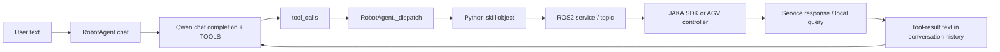

# Original Call Chain

## Evidence by hop

1. User input is appended to `_history` at `chat_agent/skills/robot_agent.py:911`.
2. The model receives the static `TOOLS` list at `robot_agent.py:913-919`.
3. Returned tool-call arguments are parsed as JSON at `robot_agent.py:930-935`.
4. `_dispatch()` selects one of the injected lift/waist/arm/head/AGV objects at `robot_agent.py:656-900`.
5. The real-SDK factory wires the component adapters at `chat_agent/skills/real_sdk_skills.py:637-644`.
6. The C++ backend creates the arm/external-axis services at `src/jaka_toolbox/jaka_toolbox/src/KargoExtAndArm.cpp:33-129`.
7. The AGV backend creates the velocity publisher, steering subscriber, and resume service client at `chat_agent/skills/agv_skill.py:116-169`.
8. Tool-result text is appended to model history at `robot_agent.py:937-941`.

## Where feedback closes—and does not close—the loop

- Lift, waist, and head dispatch branches query current values after a call (`robot_agent.py:658-676`, `848-869`). This is useful observation, but success is still the component Boolean; no shared tolerance verifier consumes the queried state.
- Arm functions query/print end-effector poses inside the real adapter (`real_sdk_skills.py:258-380`, `445-464`), but the returned Boolean remains the ROS2 service success.
- AGV `drive_distance` and `rotate_angle` convert distance/angle to a duration (`agv_skill.py:411-459`). The backend waits for steering orientation/stability (`agv_skill.py:249-271`) but does not compare odometry against a target displacement in this Agent path.
- `JagvNavigation` does subscribe to odometry and motion state (`JagvNavigation.cpp:22-40`, `152-176`) and exposes navigation services (`JagvNavigation.cpp:66-126`), but those interfaces are separate from the Agent's elementary `cmd_vel` tools.

## Multi-step behavior

The model can request multiple calls, and the loop processes them in returned order. A later result may influence a subsequent model round because it is added to chat history. That is opportunistic tool chaining, not an explicit, validated execution plan: no step IDs, plan projection, resource claims, or deterministic recovery policy exist.
