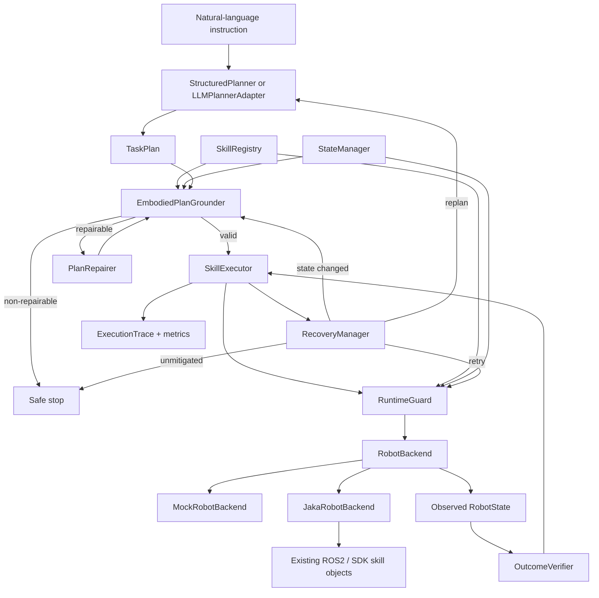
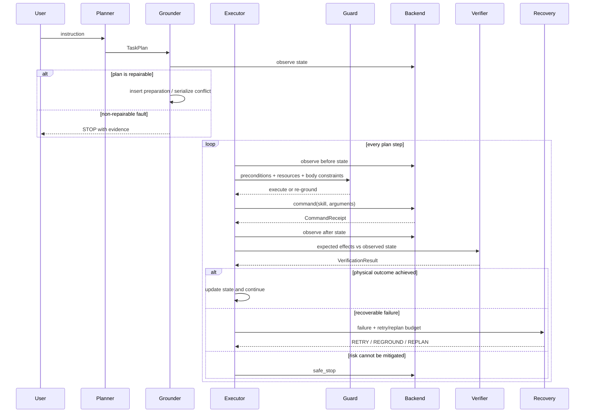

# New Architecture

EmbodiedSkill-ROS separates planning semantics from robot transport. The core depends only on typed Python interfaces; ROS2 and JAKA imports remain inside the optional legacy adapter objects supplied by the integrator.

## Component architecture

## Closed-loop execution sequence

## Decision policy

The executor implements `EXECUTE → REPAIR → REPLAN → STOP` as an escalation order:

1. Execute a grounded plan.
2. Repair unsafe/UNKNOWN arm state before AGV or lift motion and serialize conflicting parallel groups.
3. Replan once bounded local retry is exhausted, if a replanner is configured.
4. Stop when emergency/fault state is explicit, a repair remains invalid, or retry/replan budgets are exhausted.

`STOP` is therefore a terminal mitigation, not the default response to every mismatch.

## Backend boundary

- `MockRobotBackend` provides deterministic state transitions, command failure, timeout, physical failure, and state-drift injection.
- `JakaRobotBackend` imports no ROS2 module itself. It calls legacy skill objects that are constructed by the original ROS2 application.
- Unobservable fields are `None` (`UNKNOWN`). A callback-based `state_provider` and `agv_position_provider` allow an integrator to add verified observations without changing core code.

## Minimum implemented scope

Five executable skills cover four components: arm retract/extend, AGV move, lift position, and head pose. The deterministic planner intentionally handles only the documented demo language. Arbitrary natural language belongs behind `LLMPlannerAdapter`, whose output is still registry-constrained and grounded before execution.
