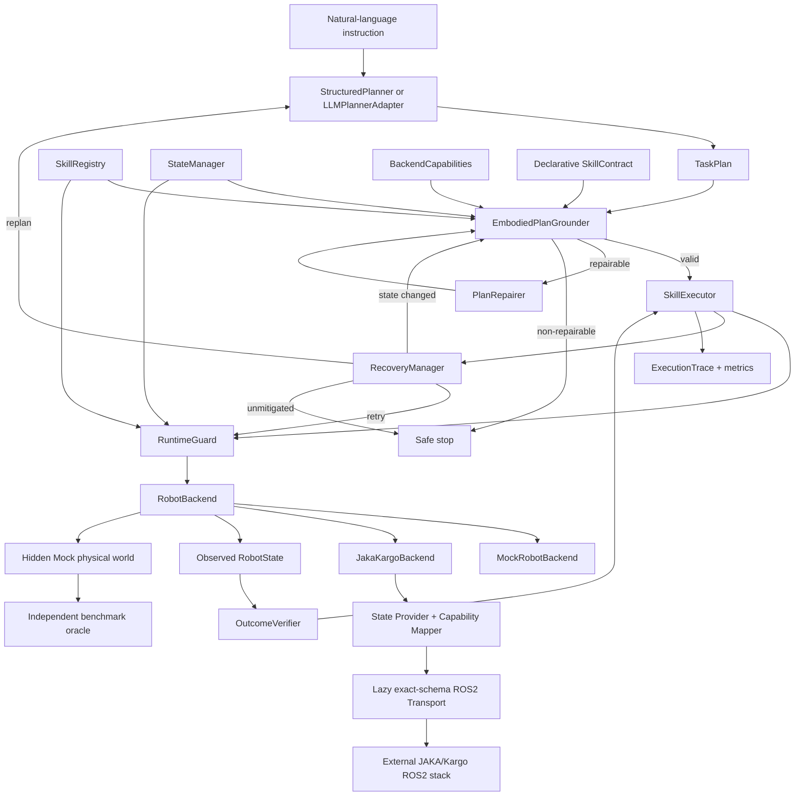
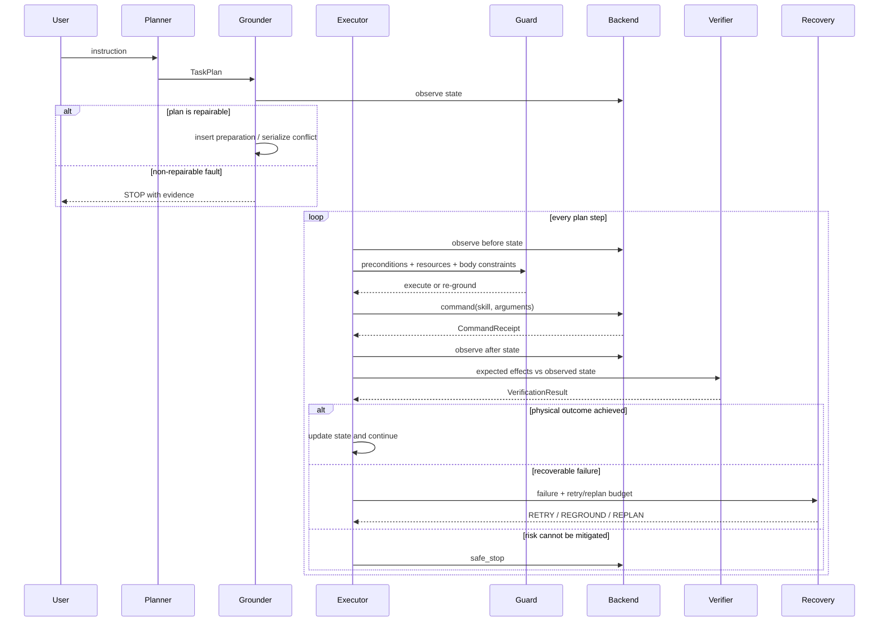

# New Architecture

EmbodiedSkill-ROS separates planning semantics from robot transport. The core depends
only on typed Python interfaces; ROS2 and JAKA imports remain inside optional
transport adapters.

## Component architecture

## Closed-loop execution sequence

## Decision policy

The executor implements `EXECUTE → REPAIR → REPLAN → STOP` as an escalation order:

1. Execute a grounded plan.
2. Repair false/UNKNOWN/STALE predicates by finding registered effects that can
   establish the missing fact; serialize incompatible parallel resources.
3. Re-synthesize unsatisfied goal facts from current observations after bounded retry.
4. Stop when emergency/fault state is explicit, a repair remains invalid, or retry/replan budgets are exhausted.

`STOP` is therefore a terminal mitigation, not the default response to every mismatch.

## Backend boundary

- `MockRobotBackend` keeps physical world truth private from its observation model,
  provides deterministic transitions and fault injection, and exposes truth only to
  the benchmark oracle.
- The earlier `JakaRobotBackend` remains a lightweight object adapter. The v0.3
  `JakaKargoBackend` adds an explicit transport, state provider, and capability
  mapper for the audited laboratory stack; neither path adds vendor imports to the
  frozen core.
- `JakaKargoRos2Transport` lazily loads externally built generated interfaces. The
  original workspace and SDK remain an external deployment dependency.
- Unobservable or uncalibrated fields are `None` (`UNKNOWN`). Service receipt never
  fabricates a state effect.
- Every backend declares supported skills, observable effects, safe-stop support, and
  runtime identity. Unsupported execution stops before command dispatch.
- The optional `mock_bridge` node imports `rclpy` only when invoked and is reserved for
  Ubuntu/Humble runtime validation.

## Minimum implemented scope

The default registry contains five executable skills across arm, AGV, lift, and
head. The JAKA/Kargo integration registry also adds a waist contract without editing
the frozen registry. New declarative skills can be registered without core edits;
the test suite demonstrates this with a tool-preparation/docking pair. The deterministic
planner intentionally handles only the documented demo language. Arbitrary natural
language belongs behind `LLMPlannerAdapter`, whose output is still registry-constrained
and grounded before execution.
