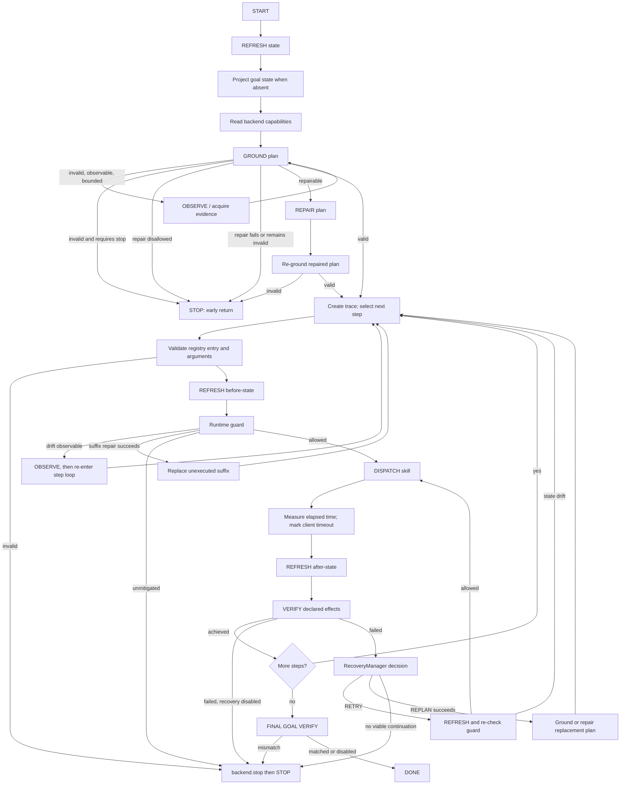

# SkillExecutor State Machine and STOP Paths

This document describes the frozen `SkillExecutor` at v0.3.0. It improves
auditability without refactoring or changing any reasoning, recovery, verification,
or dispatch semantics.

## Measured structure

- file length: 333 lines;
- `execute`: lines 113–333, 221 lines;
- control-flow inventory in `execute`: 27 `if`, 3 `while`, 2 `for`, 10 `return`,
  4 `break`, and 3 `continue` nodes;
- simple AST decision-point proxy: 46, including boolean branches and handlers.

The number is not a formal safety metric, but the nested observation, repair, retry,
and replan loops make the complexity critique reproducible. Structural refactoring is
future work because this file is protected by the freeze manifest.

## Actual control flow

An elapsed skill timeout marks the receipt as timed out after the synchronous call
returns. It does not prove server-side or physical cancellation.

## STOP transmission audit

| Trigger | `backend.stop()` invoked? | What is established |
|---|---:|---|
| Initial grounding requires STOP | No | terminal decision; prohibited dispatch is blocked |
| Initial plan is ungrounded and repair is disallowed | No | terminal decision only |
| Initial repair fails or remains invalid | No | terminal decision only |
| Unknown skill or invalid arguments inside step loop | Yes | stop request attempted |
| Runtime guard cannot observe or repair drift | Yes | stop request attempted |
| Outcome fails with recovery disabled | Yes | stop request attempted |
| Retry/replan policy has no viable continuation | Yes | stop request attempted |
| Final goal verification fails | Yes | stop request attempted |

The four early preflight returns occur before trace creation and intentionally remain
unchanged in v0.3.1. `STOP` is therefore not a universal assertion that a stop command
was sent, accepted, or physically completed.

## JAKA stop semantics

`JakaRobotBackend` can send only the legacy AGV stop. `JakaKargoBackend.stop()` calls
`transport.stop_agv(timeout)` and returns `accepted=False` even if that transport call
was accepted, because AGV-only actuation must not be promoted to a whole-robot safe
stop guarantee. Neither path confirms arm, lift, head, or whole-robot physical stop.

The current boolean `CommandReceipt.accepted` cannot express all relevant facts at
once. A future, breaking design may use a structured `StopReceipt`/`StopResult` with
separate fields such as `command_sent`, `scope`, `transport_accepted`,
`physical_stop_confirmed`, and `safety_guarantee`. That redesign is not part of this
candidate and must not be inferred from the present API.
